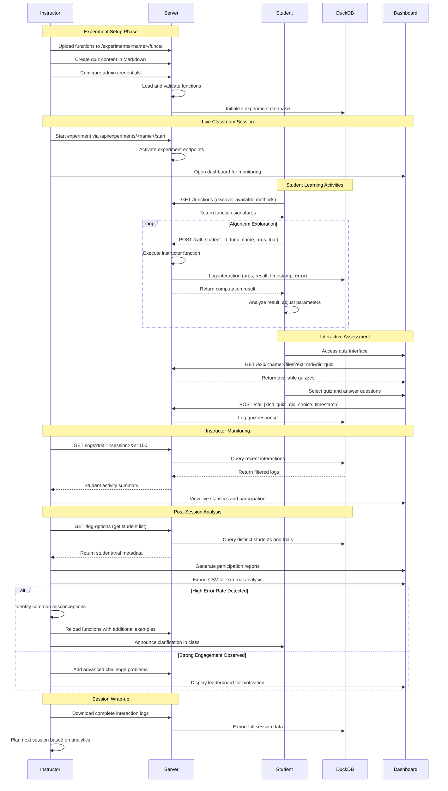

# User Interactions Flow Diagram

```mermaid
sequenceDiagram
    participant I as Instructor
    participant S as Server
    participant St as Student
    participant DB as DuckDB
    participant UI as Dashboard
    
    %% Setup Phase
    Note over I,S: Experiment Setup Phase
    I->>S: Upload functions to /experiments/<name>/funcs/
    I->>S: Create quiz content in Markdown
    I->>S: Configure admin credentials
    S->>S: Load and validate functions
    S->>DB: Initialize experiment database
    
    %% Class Session Start
    Note over I,UI: Live Classroom Session
    I->>S: Start experiment via /api/experiments/<name>/start
    S->>S: Activate experiment endpoints
    I->>UI: Open dashboard for monitoring
    
    %% Student Engagement
    Note over St,DB: Student Learning Activities
    St->>S: GET /functions (discover available methods)
    S-->>St: Return function signatures
    
    loop Algorithm Exploration
        St->>S: POST /call {student_id, func_name, args, trial}
        S->>S: Execute instructor function
        S->>DB: Log interaction (args, result, timestamp, error)
        S-->>St: Return computation result
        St->>St: Analyze result, adjust parameters
    end
    
    %% Live Quiz Participation
    Note over St,UI: Interactive Assessment
    St->>UI: Access quiz interface
    UI->>S: GET /exp/<name>/files?ext=md&dir=quiz
    S-->>UI: Return available quizzes
    St->>UI: Select quiz and answer questions
    UI->>S: POST /call {kind:'quiz', qid, choice, timestamp}
    S->>DB: Log quiz response
    
    %% Real-time Monitoring
    Note over I,UI: Instructor Monitoring
    I->>S: GET /logs?trial=<session>&n=100
    S->>DB: Query recent interactions
    DB-->>S: Return filtered logs
    S-->>I: Student activity summary
    I->>UI: View live statistics and participation
    
    %% Analytics and Feedback
    Note over I,DB: Post-Session Analysis
    I->>S: GET /log-options (get student list)
    S->>DB: Query distinct students and trials
    S-->>I: Return student/trial metadata
    I->>UI: Generate participation reports
    I->>UI: Export CSV for external analysis
    
    %% Adaptive Response
    alt High Error Rate Detected
        I->>I: Identify common misconceptions
        I->>S: Reload functions with additional examples
        I->>St: Announce clarification in class
    else Strong Engagement Observed
        I->>S: Add advanced challenge problems
        I->>UI: Display leaderboard for motivation
    end
    
    %% Session Conclusion
    Note over I,S: Session Wrap-up
    I->>S: Download complete interaction logs
    S->>DB: Export full session data
    I->>I: Plan next session based on analytics
```